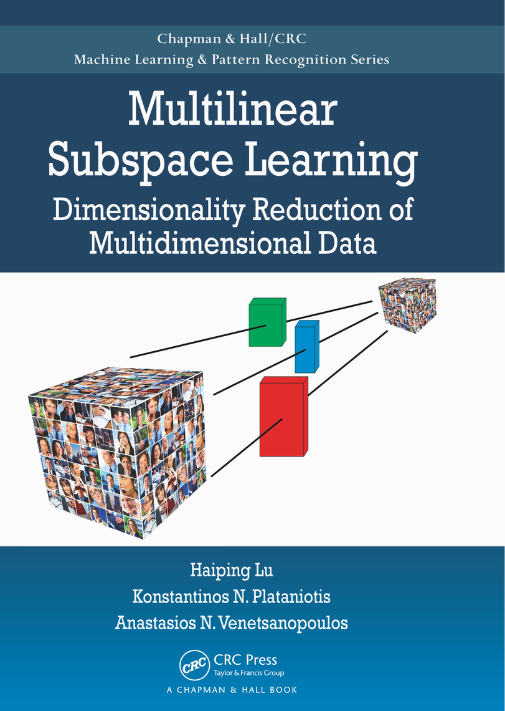

[Multilinear Subspace Learning: Dimensionality Reduction of Multidimensional Data](https://www.routledge.com/Multilinear-Subspace-Learning-Dimensionality-Reduction-of-Multidimensional/Lu-Plataniotis-Venetsanopoulos/p/book/9781439857243) is a book published December 16, 2013 by Chapman and Hall/CRC in the [Chapman & Hall/CRC Press Machine Learning and Pattern Recognition Series](https://www.routledge.com/Chapman--HallCRC-Machine-Learning--Pattern-Recognition/book-series/CRCMACLEAPAT). This page provides an overview of resources concerned with theories and applications of multilinear subspace learning (MSL). 

The origin of MSL traces back to multi-way analysis in the 1960s and they have been studied extensively in face and gait recognition. With more connections revealed and analogies drawn between multilinear algorithms and their linear counterparts, MSL has become an exciting area to explore for applications involving large-scale multidimensional
(tensorial) data as well as a challenging problem for machine learning researchers to tackle.
***
   \[ [Book/Survey](#books) \| [Software](#code) \| [Data](#data) \| [Related Sites](#related) \| [Research Papers](#references) \]
  

## <a id='booksd'>Book and Survey</a>

[Multilinear Subspace Learning: Dimensionality Reduction of Multidimensional Data](http://www.crcpress.com/product/isbn/9781439857243), [Haiping Lu](http://staffwww.dcs.shef.ac.uk/people/H.Lu/), [K. N. Plataniotis](http://www.dsp.utoronto.ca/~kostas/), and [A. N. Venetsanopoulos](http://www.dsp.toronto.edu/~anv/), Chapman & Hall/CRC Press Machine Learning and Pattern Recognition Series, Taylor and Francis, ISBN: 978-1-4398572-4-3, December 2013.

Order: [Amazon.com](http://www.amazon.com/Multilinear-Subspace-Learning-Dimensionality-Multidimensional/dp/1439857245),
[Amazon.ca](http://www.amazon.ca/Multilinear-Subspace-Learning-Dimensionality-Multidimensional/dp/1439857245),
[Amazon.co.uk](http://www.amazon.co.uk/Multilinear-Subspace-Learning-Dimensionality-Multidimensional/dp/1439857245),
[Amazon.fr](http://www.amazon.fr/Multilinear-Subspace-Learning-Dimensionality-Multidimensional/dp/1439857245),
[Amazon.de](http://www.amazon.de/Multilinear-Subspace-Learning-Dimensionality-Multidimensional/dp/1439857245),
[Amazon.co.jp](http://www.amazon.co.jp/Multilinear-Subspace-Learning-Dimensionality-Multidimensional/dp/1439857245),
[亚马逊中国](http://www.amazon.cn/Multilinear-Subspace-Learning-Dimensionality-Multidimensional/dp/1439857245),
[CRC Press (Save 20%)](http://staffwww.dcs.shef.ac.uk/people/H.Lu/files/MSLbook_CRC2013.pdf)\
Contents: [Table of Contents](http://staffwww.dcs.shef.ac.uk/people/H.Lu/MSL/MSLbook-TOC.pdf);
[Preview](http://books.google.com.hk/books?id=4F_vAgAAQBAJ&printsec=frontcover&dq=isbn:1439857245&hl=en&sa=X&ei=1kG7U4uqD5L38QXc3oDICw&redir_esc=y#v=onepage&q&f=false)\
Sample Chapters: [Chapter 1](http://staffwww.dcs.shef.ac.uk/people/H.Lu/MSL/MSLbook-Chapter1.pdf), [Chapter
3](http://staffwww.dcs.shef.ac.uk/people/H.Lu/MSL/MSLbook-Chapter3.pdf)\
Review: Recommended at computingreviews.com ([Review Link](http://www.computingreviews.com/review/review_review.cfm?review_id=142849);
[PDF](http://staffwww.dcs.shef.ac.uk/people/H.Lu/MSL/MSLbook-ComputingReview.pdf))\
Errata/Corrections: [Errata - 19 Jan 2015](http://staffwww.dcs.shef.ac.uk/people/H.Lu/MSL/MSLBookErrata.pdf), [Corrections -15 Feb
2014](http://staffwww.dcs.shef.ac.uk/people/H.Lu/MSL/MSLbookCorrections20140215.pdf)\
Software: [Open Source Software](#code)\
Data: [2D face data & 3D gait data](#data)

[A Survey of Multilinear Subspace Learning for Tensor
Data](http://www.dsp.utoronto.ca/~haiping/Publication/SurveyMSL_PR2011.pdf), Haiping Lu, K. N. Plataniotis, and A. Venetsanopoulos, Pattern Recognition, Vol. 44, No. 7, pp. 1540-1551, Jul. 2011.

## <a id='code'>Software</a>

Open source software on multilinear subspace learning algorithms:

- The [Matlab Tensor Toolbox](http://csmr.ca.sandia.gov/%7Etgkolda/TensorToolbox/)
- [MPCA](http://www.mathworks.com/matlabcentral/fileexchange/26168): the multilinear principal component analysis algorithm, a     multilinear extension of PCA, including code, data and paper.
- [UMPCA](http://www.mathworks.com/matlabcentral/fileexchange/35432): the uncorrelated multilinear principal component analysis algorithm, including code, data and paper.
- [UMLDA](http://www.mathworks.com/matlabcentral/fileexchange/35782) : the uncorrelated multilinear discriminant analysis algorithm, including code, data and paper.

## <a id='data'>Data</a>

The FERET face data (2-D tensor, i.e, matrix) and training/test
partitions:\
C=number of subjects; A=max angle;S: number of samples/subject\
[C70A15S8 (3.09M)](http://staffwww.dcs.shef.ac.uk/people/H.Lu/CodeData/feretc70a15s8.zip); [C80A45S6
(893K)](http://staffwww.dcs.shef.ac.uk/people/H.Lu/CodeData/feretc80a45s6.zip); [C160A45S6
(1.32M)](http://staffwww.dcs.shef.ac.uk/people/H.Lu/CodeData/feretc160a45s6.zip); [C240A45S6
(1.68M)](http://staffwww.dcs.shef.ac.uk/people/H.Lu/CodeData/feretc240a45s6.zip); [C320A45S6
(2.04M)](http://staffwww.dcs.shef.ac.uk/people/H.Lu/CodeData/feretc320a45s6.zip).

The CMU PIE face data (2-D tensor, i.e, matrix) and training/test
partitions: [PIEP3I3 (10.2M)](http://staffwww.dcs.shef.ac.uk/people/H.Lu/CodeData/piep3i3.zip).

The USF gait data version 1.7 (3-D tensor): [128x88x20
(21.2M)](http://staffwww.dcs.shef.ac.uk/people/H.Lu/CodeData/USFGait17_128x88x20.zip); [64x44x20
(9.9M)](http://staffwww.dcs.shef.ac.uk/people/H.Lu/CodeData/USFGait17_64x44x20.zip); [32x22x10
(3.2M)](http://staffwww.dcs.shef.ac.uk/people/H.Lu/CodeData/USFGait17_32x22x10.zip).

## <a id='related'>Related Web Sites</a>

[Wikipedia entry](http://en.wikipedia.org/wiki/Multilinear_subspace_learning) on Multilinear Subspace Learning. 

## <a id='references'>Bibliography</a>

Papers relevant to MSL are ordered below according to topic, with
occasional papers occurring under multiple headings.
***
   \[ [Tutorials](#tut) \|  [Tensor2Tensor](#ttp) \| [Tensor2Vector](#tvp) \]
  
### <a id='tut'>Tutorials</a>

Tutorial materials suitable for a first introduction to MSL.
Prerequisites: elementary probability theory, statistics and linear
algebra.

H. Lu, K. N. Plataniotis, and A. N. Venetsanopoulos, [Multilinear Subspace Learning: Dimensionality Reduction of Multidimensional
Data](http://www.crcpress.com/product/isbn/9781439857243), Chapman & Hall/CRC Press Machine Learning and Pattern Recognition Series, Taylor and Francis, ISBN: 978-1-4398572-4-3, 2013.

H. Lu, K. N. Plataniotis, and A. N. Venetsanopoulos, [A Survey of Multilinear Subspace Learning for Tensor Data](http://www.dsp.utoronto.ca/%7Ehaiping/Publication/SurveyMSL_PR2011.pdf),
Pattern Recognition, Vol. 44, No. 7, pp. 1540-1551, Jul.
2011.

T. G. Kolda, B. W. Bader, [Tensor decompositions and applications](http://portal.acm.org/citation.cfm?id=1655230), SIAM Review, Vol. 51, No. 3, pp. 455-500, 2009.

L. D. Lathauwer, B. D. Moor, J. Vandewalle, [On the best rank-1 and rank-(R1, R2, \..., RN ) approximation of higher-order tensors](http://portal.acm.org/citation.cfm?id=354405),
SIAM Journal of Matrix Analysis and Applications 21 (4) (2000)
1324-1342.

L.D. Lathauwer, B.D. Moor, J. Vandewalle, [A multilinear singular value decomposition](http://portal.acm.org/citation.cfm?id=354398),
SIAM Journal of Matrix Analysis and Applications vol. 21, no. 4, pp.
1253-1278, 2000.

### <a id='ttp'>MSL through Tensor-to-Tensor Projection</a>

MSL algorithms that project a tensor directly to another tensor of
lower dimension.

H. Lu, K. N. Plataniotis, and A. N. Venetsanopoulos, [MPCA: Multilinear Principal Component Analysis of Tensor
Objects](http://www.dsp.utoronto.ca/%7Ehaiping/Publication/MPCA_TNN08_rev2010.pdf), IEEE Trans. on Neural Networks, Vol. 19, No. 1, Page: 18-39, Jan. 2008.

D. Tao, X. Li, X. Wu, and S. J. Maybank, [General tensor discriminant analysis and gabor features for gait recognition](http://dx.doi.org/10.1109/TPAMI.2007.1096), IEEE Trans. Pattern Anal. Mach. Intell., vol. 29, no. 10, pp. 1700-1715, Oct. 2007.

S. Yan, D. Xu, Q. Yang, L. Zhang, X. Tang, and H.-J. Zhang, [Discriminant analysis with tensor representation](http://portal.acm.org/citation.cfm?id=1068959), in Proc. IEEE Conference on Computer Vision and Pattern Recognition, vol. I, June 2005, pp. 526-532.

X. He, D. Cai, P. Niyogi, [Tensor subspace analysis](http://books.nips.cc/papers/files/nips18/NIPS2005_0249.pdf)], in: Advances in Neural Information Processing Systemsc 18 (NeurIPS), 2005.

### <a id='tvp'>MSL through Tensor-to-Vector Projection</a>

MSL algorithms that project a tensor directly to a vector of lower
dimension.

H. Lu, K. N. Plataniotis, and A. N. Venetsanopoulos, [Uncorrelated Multilinear Principal Component Analysis for Unsupervised Multilinear Subspace Learning](http://www.dsp.utoronto.ca/%7Ehaiping/Publication/UMPCA_TNN09.pdf), IEEE Trans. on Neural Networks, Vol. 20, No. 11, Page: 1820-1836, Nov. 2009.

H. Lu, K. N. Plataniotis, and A. N. Venetsanopoulos, [Uncorrelated Multilinear Discriminant Analysis with Regularization and
Aggregation for Tensor Object Recognition](http://www.dsp.utoronto.ca/%7Ehaiping/Publication/UMLDA_TNN08.pdf), IEEE Trans. on Neural Networks, Vol. 20, No. 1, Page: 103-123, Jan. 2009.

***
***
This page is maintained by [Haiping Lu](https://haipinglu.github.io/) and its layout design follows www.gaussianprocess.org. Please send suggestions for corrections or additions  via email to: hplu \[at\] ieee \[dot\] org.\
Latest update: December 30, 2021.
